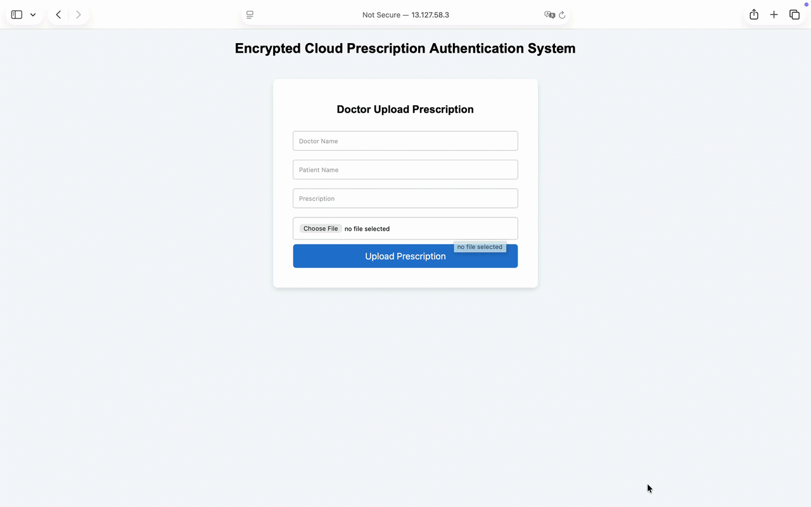

# 🔐 Encrypted Cloud Prescription Authentication System

A **secure, scalable, and real-time prescription verification system** built using cloud technologies to prevent misuse and ensure authenticity in healthcare workflows.

This system enables **instant validation of prescriptions** using QR codes and unique IDs, reducing fraud and improving trust between doctors, pharmacies, and patients.

---

## 🚀 Problem Statement

Fake and duplicate prescriptions are a growing concern in healthcare systems, leading to:

- Unauthorized access to medicines  
- Lack of trust in prescription authenticity  
- Manual and inefficient verification processes  

There is a need for a **digital, reliable, and real-time verification mechanism**.

---

## 💡 Solution Overview

This project implements a **cloud-based authentication pipeline** where:

- Doctors upload prescriptions securely to the cloud  
- Each prescription is assigned a **unique ID and QR code**  
- Pharmacies/users can **scan or enter ID to verify authenticity instantly**  

The system ensures:

- **Integrity** (no tampering)  
- **Traceability** (each prescription uniquely tracked)  
- **Real-time access** (instant verification)  

---

## 🎥 System Demo

### 👨‍⚕️ Doctor Upload & Verification via Link

- Doctor uploads prescription  
- File stored securely in cloud  
- Verification performed using generated link  

---

### 📱 QR Code-Based Verification

- QR code scanned by user/pharmacist  
- System fetches data from cloud  
- Verification result displayed instantly  

---

## ☁️ System Architecture

    User (Doctor / Pharmacist)
            │
            ▼
    Web Interface (HTML/CSS/JS)
            │
            ▼
    Amazon API Gateway
            │
            ▼
    AWS Lambda Functions
    • Upload Handler
    • Verification Handler
            │
            ▼
    Storage Layer
       ├── Amazon S3 (Prescription Images)
       └── DynamoDB (Metadata + IDs)
            │
            ▼
    Real-time Verification Response

### Design Highlights

- **Serverless architecture** for scalability and cost efficiency  
- **Decoupled components** (frontend, API, compute, storage)  
- **Low-latency request handling** for real-time validation  

---

## 🛠️ Technologies Used

### ☁️ Cloud & Backend

- AWS Lambda (serverless compute)  
- API Gateway (REST APIs)  
- DynamoDB (NoSQL database)  
- Amazon S3 (object storage)  

### 💻 Frontend

- HTML, CSS, JavaScript  

### 🔐 Security & Validation

- QR Code-based authentication  
- Unique Prescription ID mapping  
- Controlled API access  

---

## ⭐ Key Features

- 🔐 **Secure cloud storage** for prescriptions  
- 📱 **QR-based instant verification**  
- ⚡ **Real-time authentication via APIs**  
- ☁️ **Scalable serverless architecture**  
- 🧾 **Unique ID tracking for each prescription**  

---

## 🧠 Key Learnings

- Designed an **end-to-end distributed system** (frontend → API → cloud backend)  
- Gained hands-on experience with **serverless architecture on AWS**  
- Understood **real-world constraints** like scalability, latency, and security  
- Built a system focusing on **reliability and practical usability**, not just implementation  

---

## 📈 Future Enhancements

- 🤖 **AI/NLP integration** to extract and process prescription data  
- 🚨 **Anomaly detection** for suspicious prescription patterns  
- 👥 Role-based dashboards (Doctor / Pharmacy / Admin)  
- 🔐 Advanced encryption and access control mechanisms  

---

## ⚙️ Setup Notes

To deploy the system:

- Configure AWS Lambda functions  
- Set up API Gateway endpoints  
- Create S3 bucket for storage  
- Initialize DynamoDB for metadata  

---

## 🌐 Live Demo

Currently disabled (EC2 instance stopped to avoid cloud costs).

---

## 📌 Repository Contents

- Source code (frontend + backend logic)  
- Cloud architecture setup  
- Verification modules  
- Demo assets  

---

## 👨‍💻 Author

**Ruturaj Warkad**  
B.Tech Computer Engineering, PCCOE  

---

## 📜 License

For educational and demonstration purposes.
